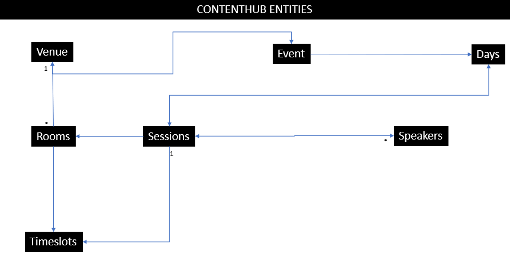

# README or don't

This is a [Next.js](https://nextjs.org/) project bootstrapped with [`create-next-app`](https://github.com/vercel/next.js/tree/canary/packages/create-next-app).

## Stack

We will be using:

- NextJS
- React
- Headless CMS - Sitecore Content Hub - Content As A Service (CAAS) - Sitecore Experience Edge

## Getting Started

First, run the development server:

```bash
npm install
npm run-script build
npm start
```

Open [http://localhost:3030](http://localhost:3030) with your browser to see the result.

You can start editing the page by modifying `pages/index.tsx`. The page auto-updates as you edit the file.

[API routes](https://nextjs.org/docs/api-routes/introduction) can be accessed on [http://localhost:3000/api/hello](http://localhost:3000/api/hello). This endpoint can be edited in `pages/api/hello.tsx`.

The `pages/api` directory is mapped to `/api/*`. Files in this directory are treated as [API routes](https://nextjs.org/docs/api-routes/introduction) instead of React pages.

## Things to know

- .env.local file is already added with hardcoded url and api keys:

```
PREVIEW_API_KEY=YOUR_PREVIEW_API_KEY
DELIVERY_API_KEY=YOUR_DELIVERY_API_KEY
PREVIEW_ENDPOINT_URL=URL_OF_YOUR_PREVIEW_GRAPHQL_ENDPOINT
DELIVERY_ENDPOINT_URL=URL_OF_YOUR_DELIVERY_GRAPHQL_ENDPOINT
```

- Please use preview mode to view data
  - Delivery mode is not working at this moment

- The playground
  - goto: <https://edge-beta.sitecorecloud.io/api/graphql/ide>
  - Use this delivery api key as header for "X-GQL-Token"

  - a sample query that returns the full set

```graphql
query {
  allEG_Venue {
    results {
      id
      taxonomyName
      description
      event_Venue {
        taxonomyName
        description
        startDate
        endDate
        event_City {
          taxonomyName
        }
        event_days {
          results {
            taxonomyName
            day_Session {
              results {
                taxonomyName
                session_Room {
                  taxonomyName
                }
              }
            }
          }
        }
      }
      venue_Room {
        results {
          id
          taxonomyName
          taxonomyLabel
          room_Timeslot {
            results {
              id
              taxonomyName
            }
          }
        }
      }
    }
  }
}
```

- The relationship so far looks like below

