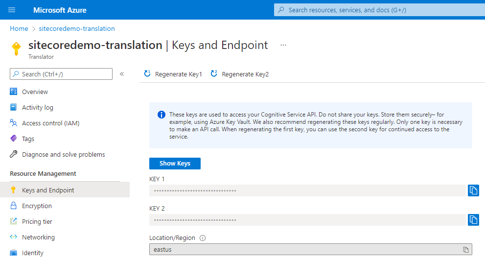
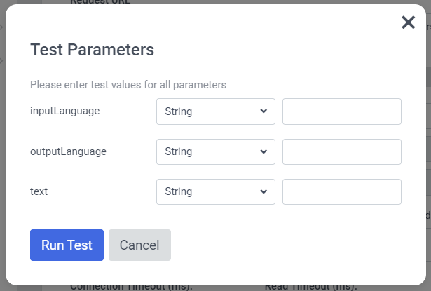
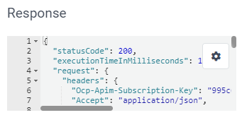
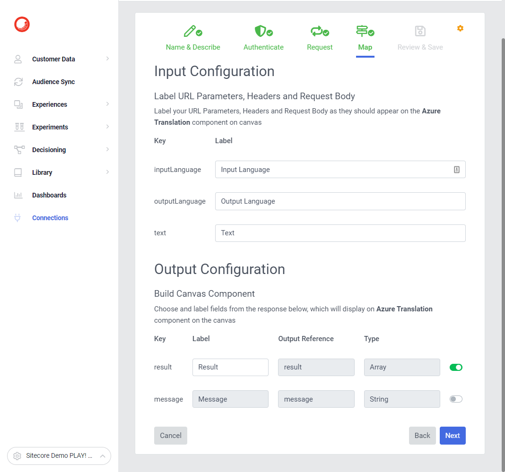

# Connection - Azure Translation

[Serialized assets](/demo/experience/personalize/connections/Azure%20Translation)

## How to Replicate

1. Navigate to the connections listing page under Developer Center.

   

2. Click the "Create connection" button.

   

3. Choose "Data System".

   

4. Enter the following information:

   | Field       | Value                                    |
   | ----------- | ---------------------------------------- |
   | Name        | Azure Translation                        |
   | Description | Translate text using azure translate api |
   | Icon        | Other                                    |

5. Click the "Next" button.
6. For authentication, select none.

   

7. Click the "Next" button.

   

8. Enter the following information:

   | Field              | Value                                                                                                                |
   | ------------------ | -------------------------------------------------------------------------------------------------------------------- |
   | Request Method     | POST                                                                                                                 |
   | Request URL        | `https://api.cognitive.microsofttranslator.com/translate?api-version=3.0&from=${inputLanguage}&to=${outputLanguage}` |
   | Headers            | See below for headers                                                                                                |
   | Connection Timeout | 1000                                                                                                                 |
   | Read Timeout       | 1000                                                                                                                 |
   | Request            | <pre>[  {  "text": "${text}"  } ]</pre>                                                              |

   | Header Name                  | Header Value                                                           |
   | ---------------------------- | ---------------------------------------------------------------------- |
   | Accept                       | application/json                                                       |
   | Accept-Encoding              | gzip                                                                   |
   | Content-Type                 | application/json                                                       |
   | Ocp-Apim-Subscription-Key    | One of your Azure Translation service key (See screenshot below).      |
   | Ocp-Apim-Subscription-Region | Your Azure Translation service location/region (See screenshot below). |

   

9. Click the "Test Request" button.

   

10. Enter the following information:

    | Field          | Value   |
    | -------------- | ------- |
    | inputLanguage  | en      |
    | outputLanguage | fr      |
    | text           | Welcome |

11. Click the "Run Test" button.
12. Ensure the response box contains a valid response with a `statusCode` of `200`.

    

13. Click the "Next" button.

    

14. Set the following input configuration:

    | Key            | Label           |
    | -------------- | --------------- |
    | inputLanguage  | Input Language  |
    | outputLanguage | Output Language |
    | text           | Text            |

15. Set the following output configuration:

    | Key     | Label  | Enabled |
    | ------- | ------ | ------- |
    | result  | Result | Yes     |
    | message |        | No      |

16. Click the "Next" button.
17. In the "Review & Save" step, click the "Save" button.
