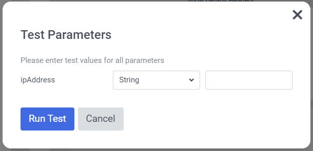

# Connection - Get City From MaxMind

[Serialized assets](/demo/experience/personalize/connections/Get%20City%20from%20MaxMind)

## How to Replicate

1. Navigate to the connections listing page under Developer Center.

   

2. Click the "Create connection" button.

   

3. Choose "Data System".

   

4. Enter the following information:

   | Field       | Value                                                       |
   | ----------- | ----------------------------------------------------------- |
   | Name        | Get City From MaxMind                                       |
   | Description | Get the city of an IP address using MaxMind geolocation api |
   | Icon        | Other                                                       |

5. Click the "Next" button.
6. For authentication, select basic.

   

7. Enter the following information:

   | Field    | Value                    |
   | -------- | ------------------------ |
   | Username | Your MaxMind account ID  |
   | Password | Your MaxMind license key |

8. Click the "Next" button.

   

9. Enter the following information:

   | Field              | Value                                               |
   | ------------------ | --------------------------------------------------- |
   | Request Method     | GET                                                 |
   | Request URL        | `https://geolite.info/geoip/v2.1/city/${ipAddress}` |
   | Headers            | See below for headers                               |
   | Connection Timeout | 1000                                                |
   | Read Timeout       | 1000                                                |

   | Header Name     | Header Value     |
   | --------------- | ---------------- |
   | Accept          | application/json |
   | Accept-Encoding | gzip             |

10. Go to [https://www.whatismyip.com/](https://www.whatismyip.com/) and copy your public IP address.
11. Back in Sitecore Personalize, click the "Test Request" button.

    

12. Enter the following information:

    | Field     | Value                        |
    | --------- | ---------------------------- |
    | ipAddress | Paste your public IP address |

13. Click the "Run Test" button.
14. Ensure the response box contains a valid response with a `statusCode` of `200`.

    

15. Click the "Next" button.

    

16. Set the following input configuration:

    | Key       | Label      |
    | --------- | ---------- |
    | ipAddress | IP Address |

17. Set the following output configuration:

    | Key                | Label        | Enabled |
    | ------------------ | ------------ | ------- |
    | city               | City         | Yes     |
    | continent          |              | No      |
    | country            | Country      | Yes     |
    | location           | Location     | Yes     |
    | postal             |              | No      |
    | registered_country |              | No      |
    | subdivisions       | Subdivisions | Yes     |
    | traits             |              | No      |

18. Click the "Next" button.
19. In the "Review & Save" step, click the "Save" button.
