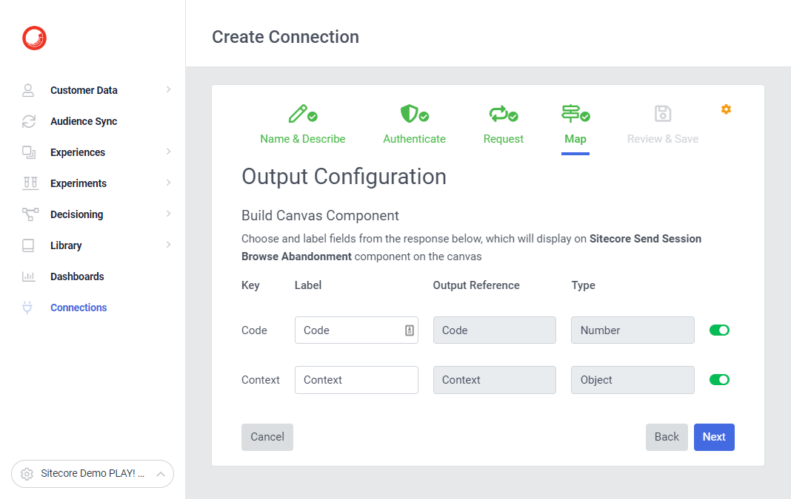

# Connection - Azure Translation

[Serialized assets](/demo/experience/personalize/connections/Sitecore%20Send%20Session%20Browse%20Abandonment)

## How to Replicate

1. Navigate to the connections listing page.

   

2. Click the "Add Connection" button.

   

3. Choose "Destination".

   

4. Enter the following information:

   |Field|Value|
   |-|-|
   |Name|Sitecore Send Session Browse Abandonment|
   |Description|Sitecore Send Session Browse Abandonment|
   |Icon|Email|

5. Click the "Next" button.
6. For authentication, select none.

   

7. Click the "Next" button.

   

8. Enter the following information:

   |Field|Value|Note|
   |-|-|-|
   |Request Method|POST||
   |Request URL|`https://api.moosend.com/v3/subscribers/ceda7fd4-df53-4e10-b6dc-8a637266d141/subscribe.json?apikey=Redacted`|Change `Redacted` for the Sitecore Send API key. Ask the demo team.|
   |Headers|See below for headers||
   |Connection Timeout|1000||
   |Read Timeout|1000||
   |Request|<pre>{   \"Name\": \"SitecoreDemo\",   \"Email\": \"test@test.com\",   \"HasExternalDoubleOptIn\": true,   \"CustomFields\": [] }</pre>||

   |Header Name|Header Value|
   |-|-|
   |Accept|application/json|
   |Accept-Encoding|gzip|
   |Content-Type|application/json|

9. Click the "Test Request" button.
10. Ensure the response box contains a valid response with a `statusCode` of `200`.

    

11. Click the "Next" button.

    

12. Set the following output configuration:

    |Key|Label|Enabled|
    |-|-|-|
    |Code|Code|Yes|
    |Context|Context|Yes|

13. Click the "Next" button.
14. In the "Review & Save" step, click the "Save" button.
