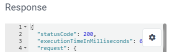
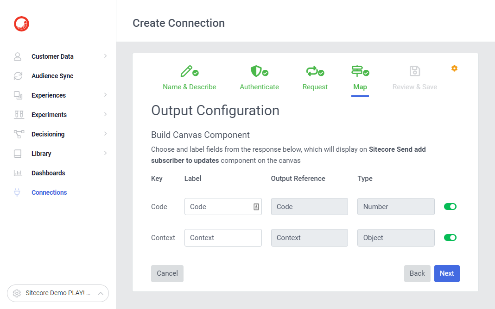

# Connection - Sitecore Send add subscriber to updates

[Serialized assets](/demo/experience/personalize/connections/Sitecore%20Send%20add%20subscriber%20to%20updates)

## How to Replicate

1. Navigate to the connections listing page under Developer Center.

   

2. Click the "Create connection" button.

   

3. Choose "Destination".

   

4. Enter the following information:

   | Field       | Value                                        |
   | ----------- | -------------------------------------------- |
   | Name        | Sitecore Send add subscriber to updates      |
   | Description | Sitecore Send add email to subscription list |
   | Icon        | Email                                        |

5. Click the "Next" button.
6. For authentication, select none.

   

7. Click the "Next" button.

   

8. Enter the following information:

   | Field              | Value                                                                                                                                                                                        | Note                                                                                                                                                   |
   | ------------------ | -------------------------------------------------------------------------------------------------------------------------------------------------------------------------------------------- | ------------------------------------------------------------------------------------------------------------------------------------------------------ |
   | Request Method     | POST                                                                                                                                                                                         |                                                                                                                                                        |
   | Request URL        | `https://api.moosend.com/v3/subscribers/{REDACTED_EMAIL_LIST_ID}/subscribe.json?apikey={REDACTED_API_KEY}`                                                                                   | Replace `{REDACTED_EMAIL_LIST_ID}` with a GUID from a Sitecore Send email list.  Replace `{REDACTED_API_KEY}` with your Sitecore Send API key. |
   | Headers            | See below for headers                                                                                                                                                                        |                                                                                                                                                        |
   | Connection Timeout | 1000                                                                                                                                                                                         |                                                                                                                                                        |
   | Read Timeout       | 10000                                                                                                                                                                                        |                                                                                                                                                        |
   | Request            | <pre>{  \"Name\": \"test\",  \"Email\": \"test@test.com\",  \"HasExternalDoubleOptIn\": false,  \"CustomFields\": [  \"Age=25\",  \"Country=USA\"  ] }</pre> |                                                                                                                                                        |

   | Header Name     | Header Value     |
   | --------------- | ---------------- |
   | Accept          | application/json |
   | Accept-Encoding | gzip             |
   | Content-Type    | application/json |

9. Click the "Test Request" button.
10. Ensure the response box contains a valid response with a `statusCode` of `200`.

    

11. Click the "Next" button.

    

12. Set the following output configuration:

    | Key     | Label   | Enabled |
    | ------- | ------- | ------- |
    | Code    | Code    | Yes     |
    | Context | Context | Yes     |

13. Click the "Next" button.
14. In the "Review & Save" step, click the "Save" button.
