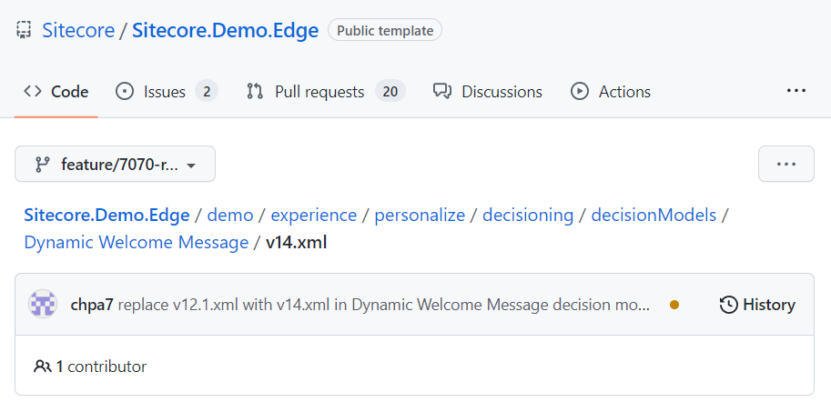

# Decision Model - Dynamic Welcome Message

[Serialized assets](/demo/experience/personalize/decisioning/decisionModels/Dynamic%20Welcome%20Message)

## How to Replicate

1. Navigate to the decision models page.

   

2. Click the "Create Decision Model" button.

   

3. Enter the following information:

   |Field|Value|
   |-|-|
   |Title|Dynamic Welcome Message|

4. Click the "Create" button.

   

5. In the draft column, click the "Add Variant" button.

   

6. Enter the following information:

   |Field|Value|
   |-|-|
   |Title|v1|

   The variant will be displayed in the draft column.

   

7. Click the v1 variant card.

   

8. In a new browser tab, open the [GitHub decision model XML file](/demo/experience/personalize/decisioning/decisionModels/Dynamic%20Welcome%20Message/v12.1.xml).

   

9. In the file content header, click the "Raw" button.

   

   The XML file will be displayed without the GitHub user interface.

10. Save this file on your computer.
11. Edit the file in a text editor.
12. Search for the `Redacted` word and replace the occurences following these instructions:

    |`Redacted` occurrences|Replacement|
    |-|-|
    |`"authType":"BASIC","username":"Redacted"`|Replace `Redacted` by the MaxMind username. Ask the demo team.|
    |`"name":"Ocp-Apim-Subscription-Key","value":"Redacted"`|Replace `Redacted` by the Azure translation subscription key. Ask the demo team.|

13. Save the file.
14. Back in Sitecore Personalize, in the canvas, click the "Import XML" button.

    

15. In the native open file window, choose the edited XML file, then click the "Open" button.
16. Once the canvas has updated, click the blue "Save" or checkmark ✔ button.
17. Click the "Close" button.

    

18. Drag the v1 variant to the production column.

    

19. Click the "Move to Production" button.

    
