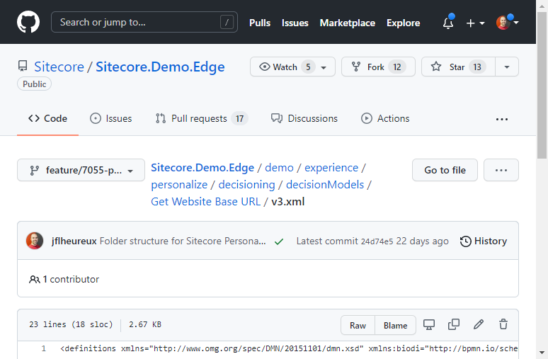

# Decision Model - Get Website Base URL

[Serialized assets](/demo/experience/personalize/decisioning/decisionModels/Get%20Website%20Base%20URL)

## How to Replicate

1. Navigate to the decision models page by clicking on Decisioning.

   

2. Click the "Create Decision Model" button.

   

3. Enter the following information:

   | Field | Value                |
   | ----- | -------------------- |
   | Title | Get Website Base URL |

4. Click the "Create" button.

   

5. In the draft column, click the "Add Variant" button.

   

6. Enter the following information:

   | Field | Value |
   | ----- | ----- |
   | Title | v1    |

   The variant will be displayed in the draft column.

   

7. Click the v1 variant card.

   

8. In a new browser tab, open the [GitHub decision model XML file](/demo/experience/personalize/decisioning/decisionModels/Get%20Website%20Base%20URL/v3.xml).

   

9. In the file content header, click the "Raw" button.

   

   The XML file will be displayed without the GitHub user interface.

10. Copy this XML file page URL.
11. Back in Sitecore Personalize, in the canvas, click the "Import XML" button.

    

12. In the native open file window, paste the XML file URL in the "File name" text box, then click the "Open" button.
13. Once the canvas has updated, click the blue "Save" or checkmark ✔ button.
14. Click the "Close" button.

    

15. Make sure you reconfigure the decision templates of the decision models after importing the XML files, if needed, because offers have different IDs in the replicated tenant.
16. Make sure to delete and re-add connections after importing the decision models XML files, if needed, because connections have different IDs in the replicated tenant.
17. Drag the v1 variant to the production column.

    

18. Click the "Move to Production" button.

    
