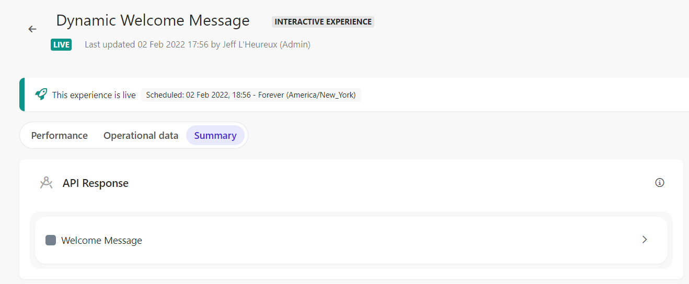
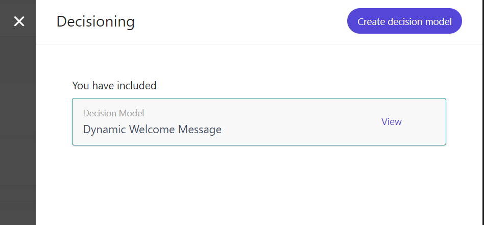
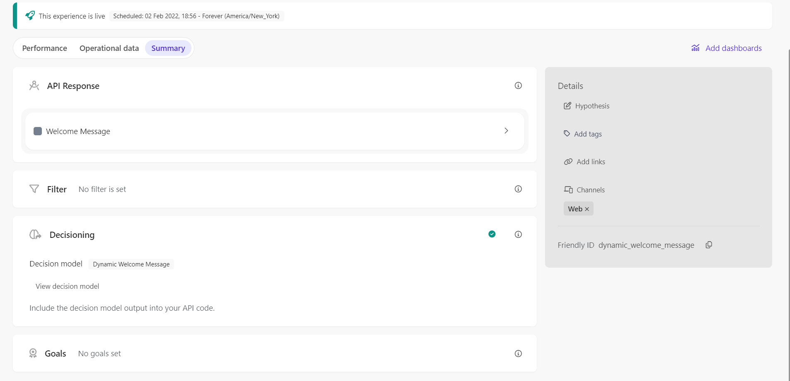

# Full Stack Experience - Dynamic Welcome Message

[Serialized assets](/demo/experience/personalize/experiences/fullStack/Dynamic%20Welcome%20Message)

## How to Replicate

1. Navigate to the full stack experiences page.

   

2. Click the "Create Experience" button.

   

3. Choose "Interactive Experience".

   

4. Enter the following information:

   | Field | Value                   |
   | ----- | ----------------------- |
   | Name  | Dynamic Welcome Message |

5. Ensure the generated ID is exactly "dynamic_welcome_message".
6. Click the "Create" button.

   

7. In the top-left corner, change the name of the variant.
   1. From: Personalisation
   2. To: Welcome Message
8. In the API tab, replace the content with the content of [this file](/demo/experience/personalize/experiences/fullStack/Dynamic%20Welcome%20Message/Welcome%20Message.txt).
9. Click the "Save" button.
10. Click the "Close" button.

    

11. Decisioning

    1. Under "Decisioning", click the "Add" button.

       

    2. Next to the "Dynamic Welcome Message" decision model, click the "Add" button.

       

    3. Close the decisioning side panel.

       

12. At the top of the page, click the "Start" button.

    

13. Click the "Start" button.
