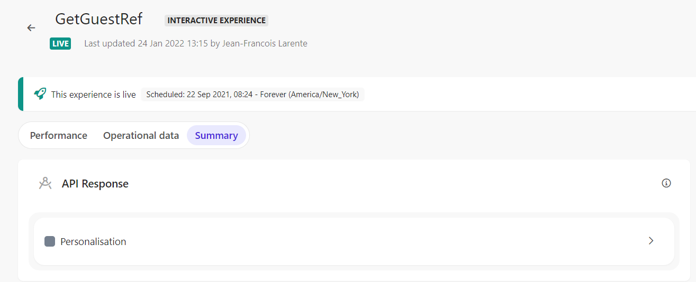
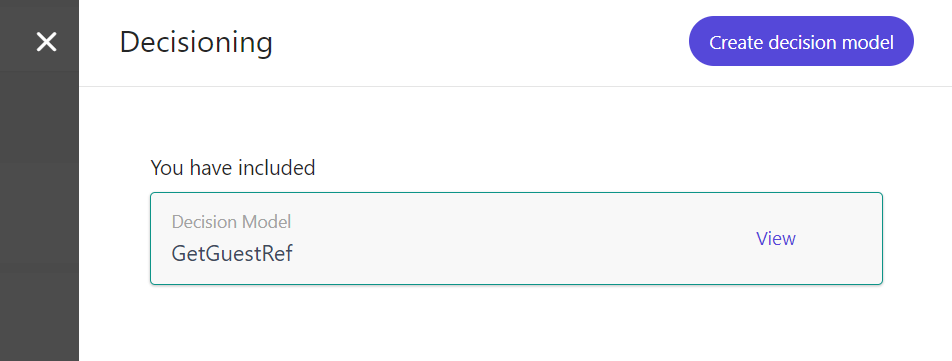
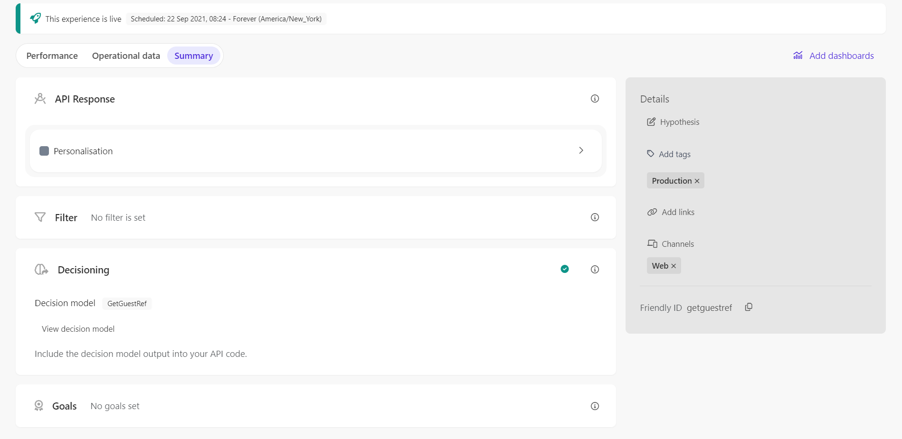

# Full Stack Experience - GetGuestRef

[Serialized assets](/demo/experience/personalize/experiences/fullStack/GetGuestRef)

## How to Replicate

1. Navigate to the full stack experiences page.

   

2. Click the "Create Experience" button.

   

3. Choose "Interactive Experience".

   

4. Enter the following information:

   | Field | Value       |
   | ----- | ----------- |
   | Name  | GetGuestRef |

5. Ensure the generated ID is exactly "getguestref".
6. Click the "Create" button.

   

7. In the API tab, replace the content with the content of [this file](/demo/experience/personalize/experiences/fullStack/GetGuestRef/Personalisation.txt).
8. Click the "Save" button.
9. Click the "Close" button.

   

10. Decisioning

    1. Under "Decisioning", click the "Add" button.

       

    2. Next to the "GetGuestRef" decision model, click the "Add" button.

       

    3. Close the decisioning side panel.

       

11. At the top of the page, click the "Start" button.

    

12. Click the "Start" button.
