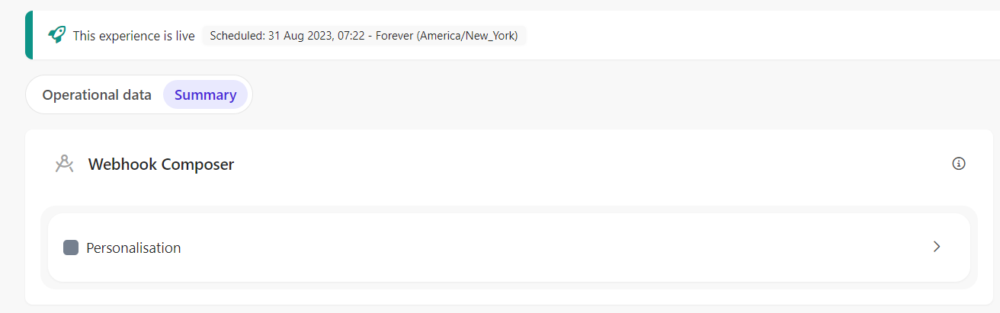
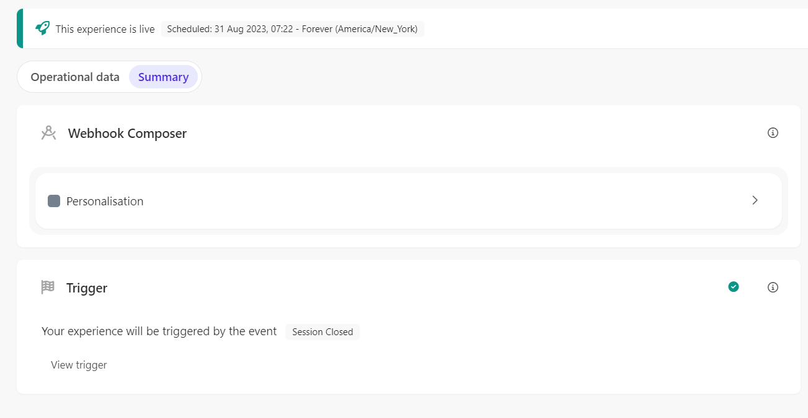
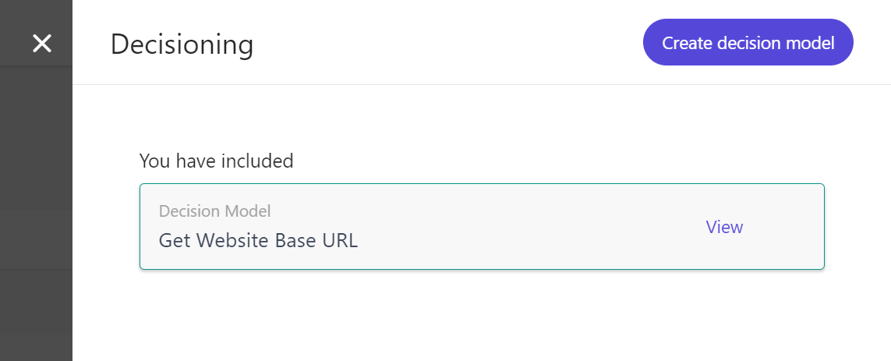
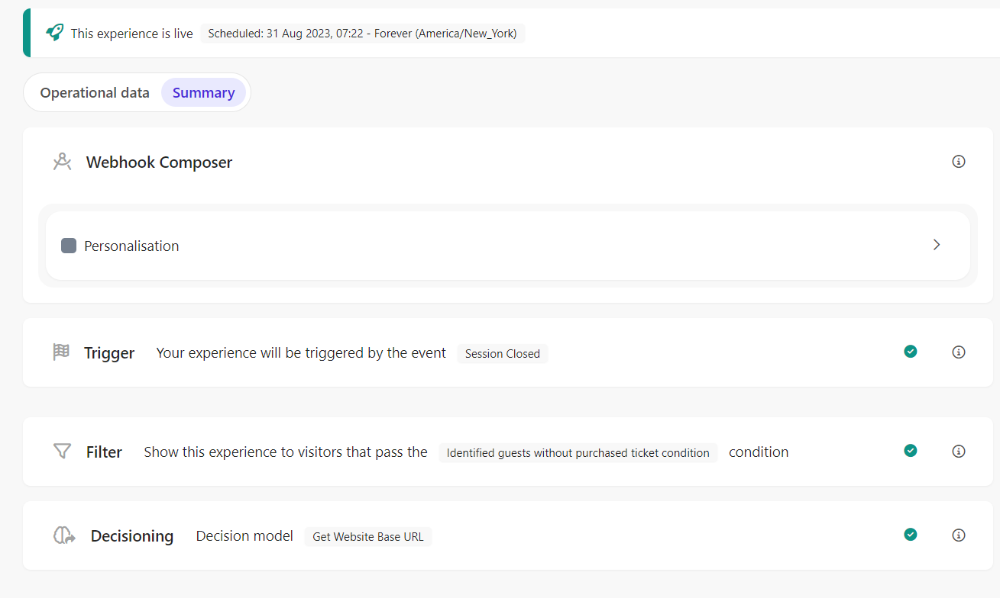

# Full Stack Experience - Session Browse Abandonment

[Serialized assets](/demo/experience/personalize/experiences/fullstack/Session%20Browse%20Abandonment)

## How to Replicate

1. Navigate to the full stack experiences page.

   

2. Click the "Create Experience" button.

   

3. Choose "Triggered Experience".

   

4. Enter the following information:

   |Field|Value|
   |-|-|
   |Name|Session Browse Abandonment|

5. Click the "Create" button.

   

6. In the choose connection sidebar, click the "Sitecore Send Session Browse Abandonment" connection name.

   

7. In the API tab, replace the content by the content of [this file](/demo/experience/personalize/experiences/fullStack/Session%20Browse%20Abandonment/Personalisation.txt).
8. Click the "Save" button.
9. Click the "Close" button.

   

10. Trigger
    1. Under "Trigger", click the "Add" button.

       

    2. In the trigger sidebar, choose the "Session Closed" trigger.
    3. Click the "Save" button.

       

11. Audience
    1. Under "Audience", click the "Add" button.

       

    2. Click on "Real-time Audience".

       

    3. After the audience templates list, click the "Add Custom Code" link.

       

    4. In the JavaScript tab, replace the content by the content of [this file](/demo/experience/personalize/experiences/fullStack/Session%20Browse%20Abandonment/Custom%20Real-Time%20Audience.js).
    5. Click the "Save" button.
    6. Click the "Close" button.

       

    7. Close the audience side panel.

       

12. Decisioning
    1. Under "Decisioning", click the "Add" button.

       

    2. Next to the "Get Website Base URL" decision model, click the "Add" button.

       

    3. Close the decisioning side panel.

       

13. At the top of the page, click the "Start" button.

    

14. Click the "Run Experience" button.
