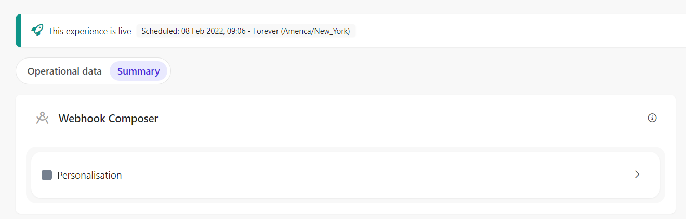
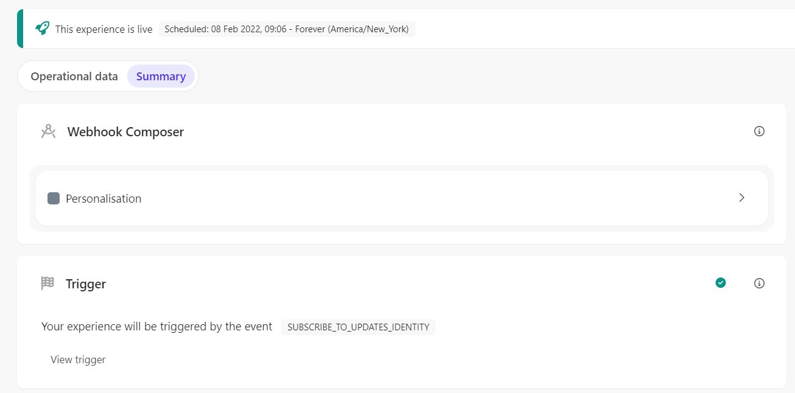
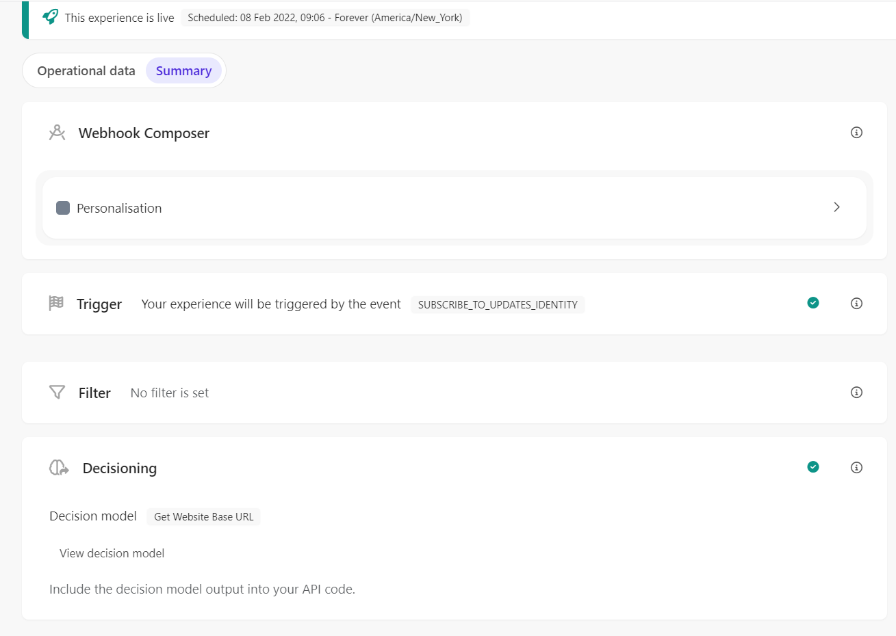

# Full Stack Experience - Subscribe to update emails

[Serialized assets](/demo/experience/personalize/experiences/fullStack/Subscribe%20to%20update%20emails)

## How to Replicate

1. Navigate to the full stack experiences page.

   

2. Click the "Create Experience" button.

   

3. Choose "Triggered Experience".

   

4. Enter the following information:

   | Field | Value                      |
   | ----- | -------------------------- |
   | Name  | Subscribe to update emails |

5. Click the "Create" button.

   

6. In the choose connection sidebar, click the "Sitecore Send add subscriber to updates" connection name.

   

7. In the API tab, replace the content with the content of [this file](/demo/experience/personalize/experiences/fullStack/Subscribe%20to%20update%20emails/Personalisation.txt).
8. Click the "Save" button.
9. Click the "Close" button.

   

10. Trigger

    1. Under "Trigger", click the "Add" button.
    2. In the trigger sidebar, choose the "Custom Trigger" option.

       

    3. Enter the following information:

       | Field                     | Value                         |
       | ------------------------- | ----------------------------- |
       | Name                      | SUBSCRIBE_TO_UPDATES_IDENTITY |
       | Description               | Subscribe to update emails    |
       | Event Identifier Operator | Equals                        |
       | Event Identifier Value    | SUBSCRIBE_TO_UPDATES_IDENTITY |

    4. Click the "Save" button.

       

11. Decisioning

    1. Under "Decisioning", click the "Add" button.

       

    2. Next to the "Get Website Base URL" decision model, click the "Add" button.

       

    3. Close the decisioning side panel.

       

12. At the top of the page, click the "Start" button.

    

13. Click the "Start" button.
