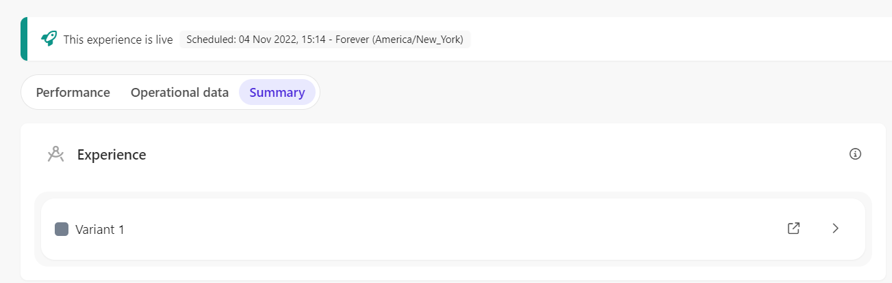
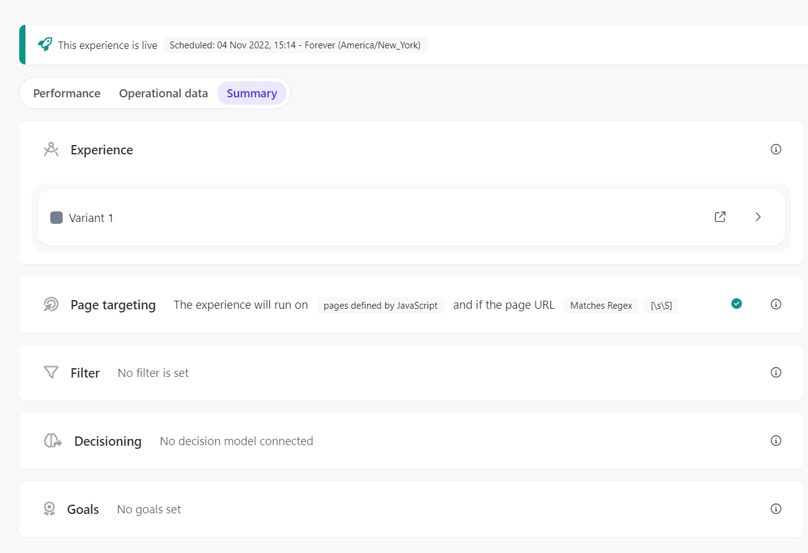

# Web Experience - Slide out guest data panel

[Serialized assets](/demo/experience/personalize/experiences/web/Slide%20out%20guest%20data%20panel)

## How to Replicate

1. Navigate to the web experiences page.

   

2. Click the "Create Experience" button.

   

3. Enter the following information:

   | Field | Value                      |
   | ----- | -------------------------- |
   | Name  | Slide out guest data panel |

4. Click the "Create" button.

   

5. Slide out guest data panel

   1. In the create variant sidebar, choose "Create template".

      

   2. In the HTML tab, replace the content by the content of [this file](/demo/experience/personalize/experiences/web/Slide%20out%20guest%20data%20panel/Variant%201.html).
   3. In the CSS tab, replace the content by the content of [this file](/demo/experience/personalize/experiences/web/Slide%20out%20guest%20data%20panel/Variant%201.css).
   4. In the JavaScript tab, replace the content by the content of [this file](/demo/experience/personalize/experiences/web/Slide%20out%20guest%20data%20panel/Variant%201.js).
   5. In the API tab, replace the content by the content of [this file](/demo/experience/personalize/experiences/web/Slide%20out%20guest%20data%20panel/Variant%201.txt).
   6. Click the "Save" button.
   7. Click the "Close" button.

      

6. Page Targeting

   1. Under "Page Targeting", click the "Specific Pages" and then the "Add conditions" button.

      

   2. Under "Advanced targeting", click the "Add script" button.

      

   3. In the JavaScript tab, replace the content by the content of [this file](/demo/experience/personalize/experiences/web/Slide%20out%20guest%20data%20panel/Advanced%20targeting%20Script.js).
   4. Click the "Save" button.
   5. Click the back button.

      

   6. Change the "Match on" dropdown selection to "Matches Regex".
   7. In the "String" field, enter `[\s\S]`.

      

   8. Click the "Save" button.
   9. Close the targeting side panel.

      

7. At the top of the page, click the "Start" button.

   

8. Click the "Start" button.
