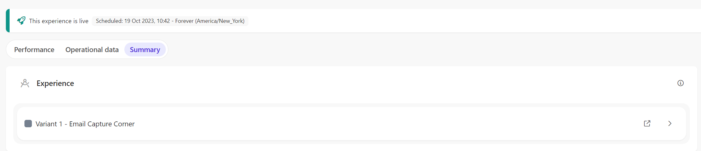

# Web Experience - Subscribe to update emails campaign

[Serialized assets](/demo/experience/personalize/experiences/web/Subscribe%20to%20update%20emails%20campaign)

## How to Replicate

1. Navigate to the web experiences page.

   

2. Click the "Create Experience" button.

   

3. Enter the following information:

   |Field|Value|
   |-|-|
   |Name|Subscribe to update emails campaign|

4. click the "Create" button.

   

5. Variant 1 - Email Capture Corner
   1. In the create variant sidebar, choose "New Empty Template".

      

   2. In the top-left corner, change the name of the variant.
      1. From: Variant 1
      2. To: Variant 1 - Email Capture Corner
   3. In the HTML tab, replace the content by the content of [this file](/demo/experience/personalize/experiences/web/Subscribe%20to%20update%20emails%20campaign/Variant%201%20-%20Email%20Capture%20Corner.html).
   4. In the CSS tab, replace the content by the content of [this file](/demo/experience/personalize/experiences/web/Subscribe%20to%20update%20emails%20campaign/Variant%201%20-%20Email%20Capture%20Corner.css).
   5. In the JavaScript tab, replace the content by the content of [this file](/demo/experience/personalize/experiences/web/Subscribe%20to%20update%20emails%20campaign/Variant%201%20-%20Email%20Capture%20Corner.js).
   6. In the API tab, replace the content by the content of [this file](/demo/experience/personalize/experiences/web/Subscribe%20to%20update%20emails%20campaign/Variant%201%20-%20Email%20Capture%20Corner.txt).
   7. Click the "Save" button.
   8. Click the "Close" button.

      

6. Page Targeting
   1. Under "Page Targeting", click the "Add" button.

      

   2. Next to "Advanced targeting", click the "Add" button.

      

   3. In the JavaScript tab, replace the content by the content of [this file](/demo/experience/personalize/experiences/web/Subscribe%20to%20update%20emails%20campaign/Advanced%20targeting%20Script.js).
   4. Click the "Save" button.
   5. Click the "Close" button.

      

   6. Delete the "Contains" page targeting entry.

      

   7. Click the "Save" button.
   8. Close the targeting side panel.

      

7. Audience
   1. Under "Audience", click the "Add" button.

      

   2. Click on "Real-time Audience".

      

   3. After the audience templates list, click the "Add Custom Code" link.

      

   4. In the JavaScript tab, replace the content by the content of [this file](/demo/experience/personalize/experiences/web/Subscribe%20to%20update%20emails%20campaign/Custom%20Real-Time%20Audience.js).
   5. Click the "Save" button.
   6. Click the "Close" button.

      

   7. Close the audience side panel.

      

8. At the top of the page, click the "Start" button.

   

9. Click the "Run Experience" button.
