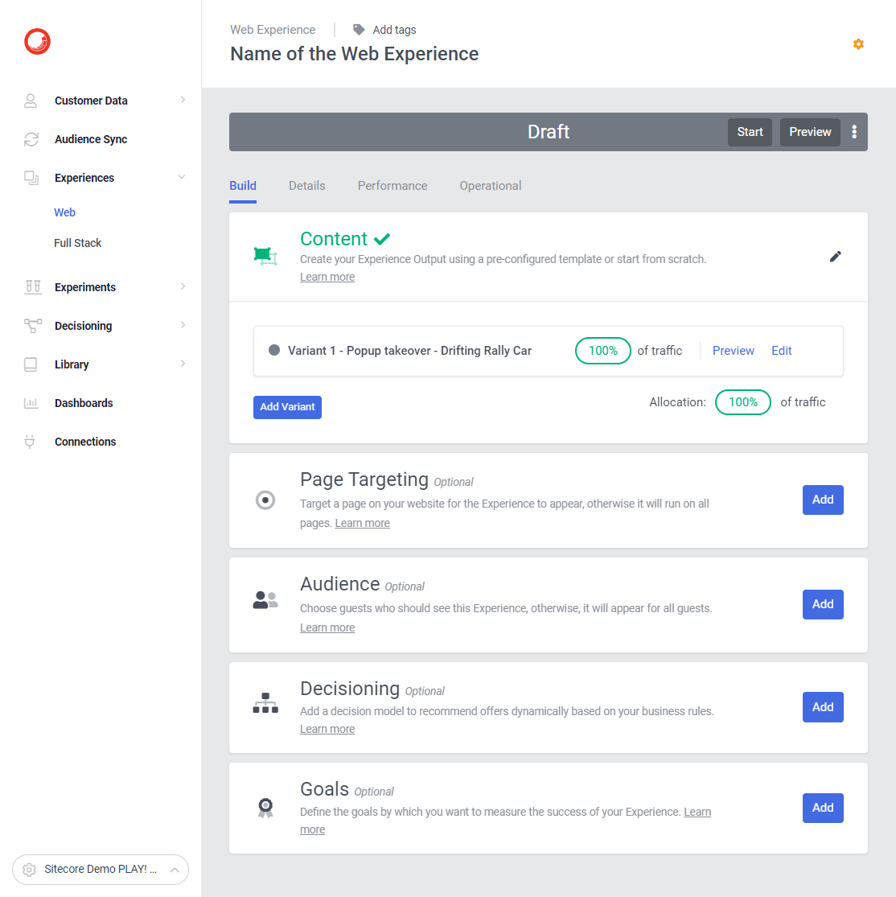
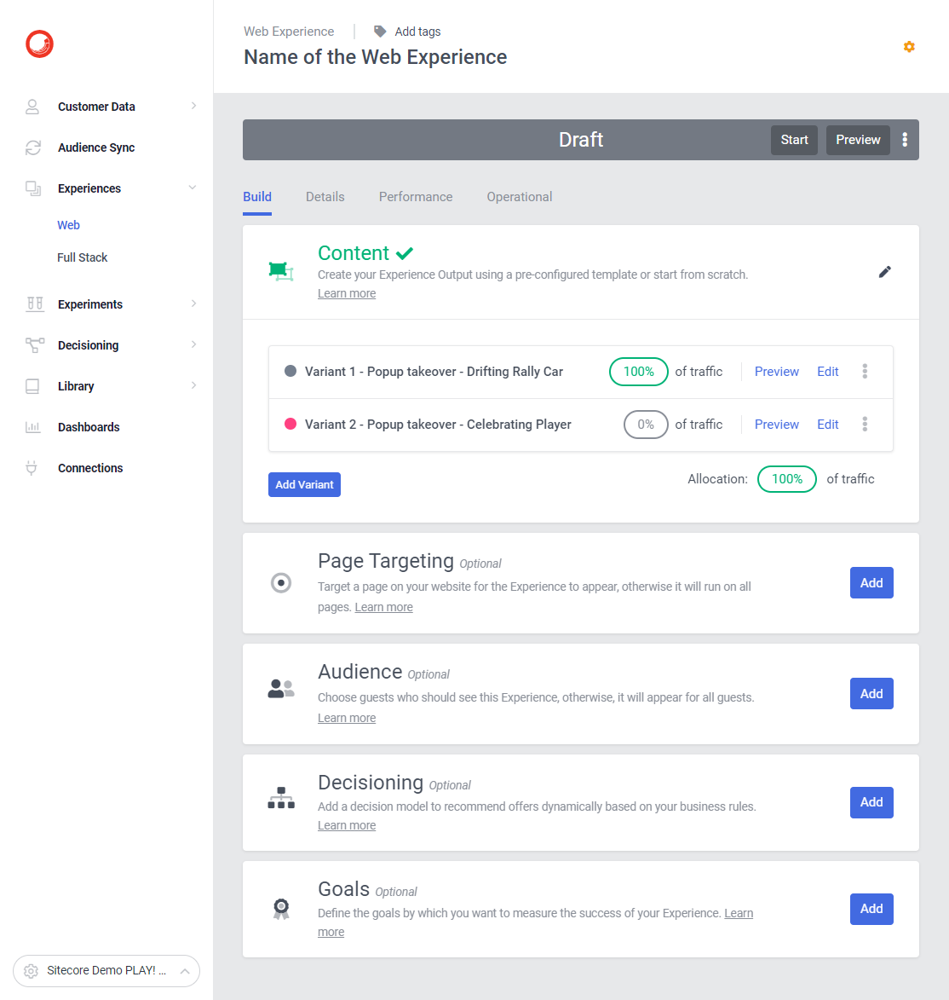
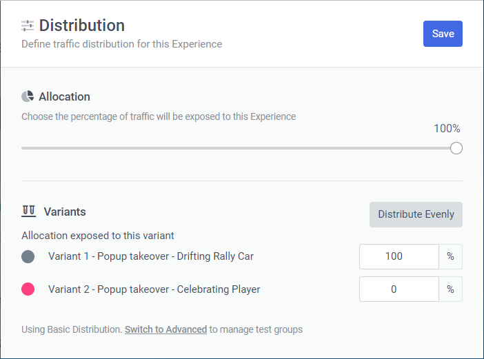
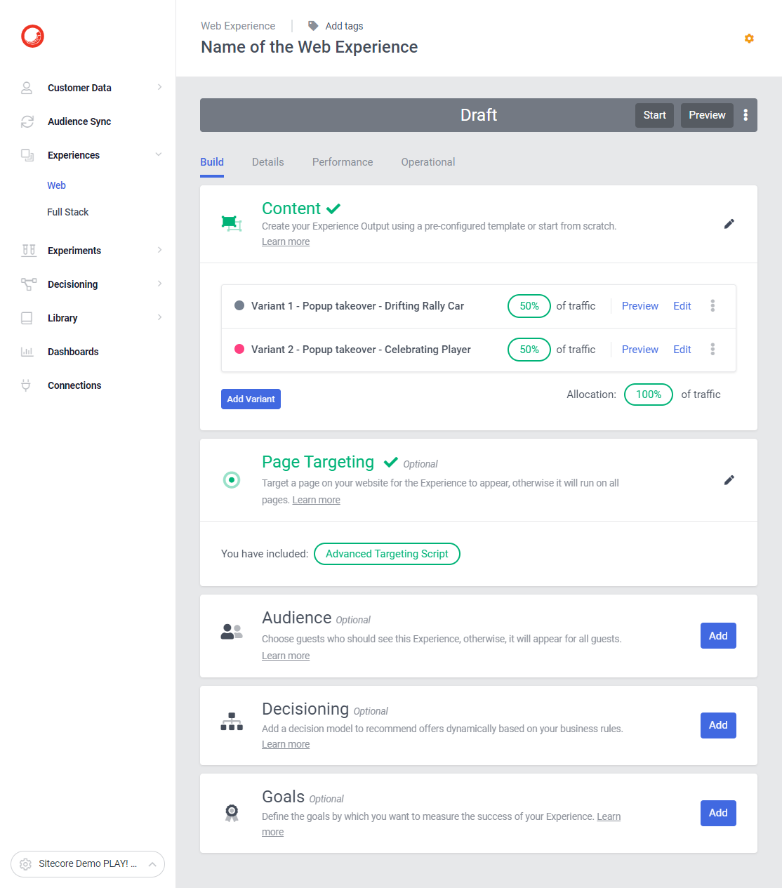
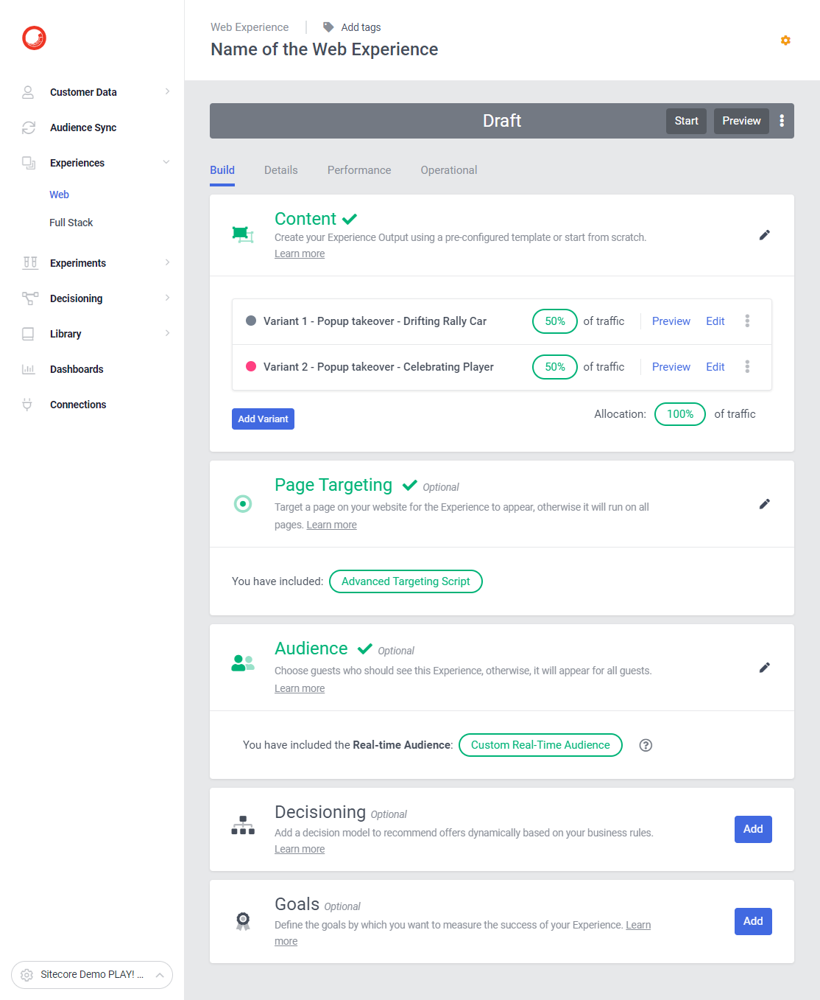
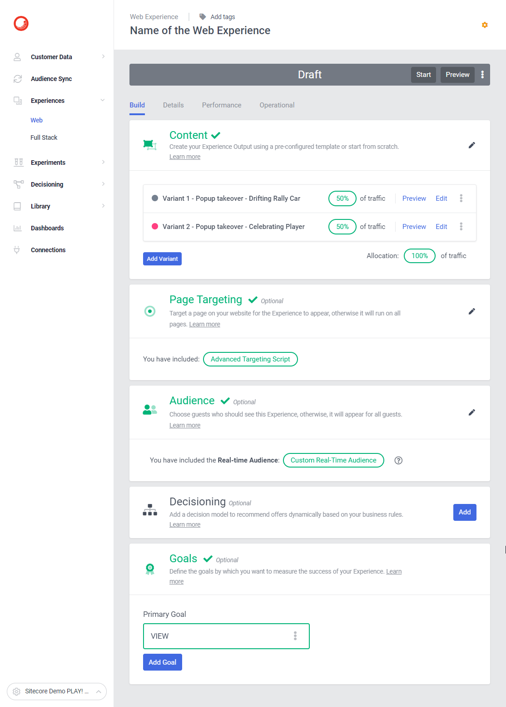

# Web Experience - Ticket Checkout - VIP Upsell

[Serialized assets](/demo/experience/personalize/experiences/web/Ticket%20Checkout%20-%20VIP%20Upsell)

## How to Replicate

1. Navigate to the web experiences page.

   

2. Click the "Create Experience" button.

   

3. Enter the following information:

   |Field|Value|
   |-|-|
   |Name|Ticket Checkout - VIP Upsell|

4. click the "Create" button.

   

5. Variant 1 - Popup takeover - Drifting Rally Car
   1. In the create variant sidebar, choose "New Empty Template".

      

   2. In the top-left corner, change the name of the variant.
      1. From: Variant 1
      2. To: Variant 1 - Popup takeover - Drifting Rally Car
   3. In the HTML tab, replace the content by the content of [this file](/demo/experience/personalize/experiences/web/Ticket%20Checkout%20-%20VIP%20Upsell/Variant%201%20-%20Popup%20takeover%20-%20Drifting%20Rally%20Car.html).
   4. In the CSS tab, replace the content by the content of [this file](/demo/experience/personalize/experiences/web/Ticket%20Checkout%20-%20VIP%20Upsell/Variant%201%20-%20Popup%20takeover%20-%20Drifting%20Rally%20Car.css).
   5. In the JavaScript tab, replace the content by the content of [this file](/demo/experience/personalize/experiences/web/Ticket%20Checkout%20-%20VIP%20Upsell/Variant%201%20-%20Popup%20takeover%20-%20Drifting%20Rally%20Car.js).
   6. In the API tab, replace the content by the content of [this file](/demo/experience/personalize/experiences/web/Ticket%20Checkout%20-%20VIP%20Upsell/Variant%201%20-%20Popup%20takeover%20-%20Drifting%20Rally%20Car.txt).
   7. Click the "Save" button.
   8. Click the "Close" button.

      

6. Variant 2 - Popup takeover - Celebrating Player
   1. Under "Content", click the "Add Variant" button.

      

   2. Choose "My Library Templates".

      

   3. Choose "New Empty Template".

      

   4. In the top-left corner, change the name of the variant.
      1. From: Variant 2
      2. To: Variant 2 - Popup takeover - Celebrating Player
   5. In the HTML tab, replace the content by the content of [this file](/demo/experience/personalize/experiences/web/Ticket%20Checkout%20-%20VIP%20Upsell/Variant%202%20-%20Popup%20takeover%20-%20Celebrating%20Player.html).
   6. In the CSS tab, replace the content by the content of [this file](/demo/experience/personalize/experiences/web/Ticket%20Checkout%20-%20VIP%20Upsell/Variant%202%20-%20Popup%20takeover%20-%20Celebrating%20Player.css).
   7. In the JavaScript tab, replace the content by the content of [this file](/demo/experience/personalize/experiences/web/Ticket%20Checkout%20-%20VIP%20Upsell/Variant%202%20-%20Popup%20takeover%20-%20Celebrating%20Player.js).
   8. In the API tab, replace the content by the content of [this file](/demo/experience/personalize/experiences/web/Ticket%20Checkout%20-%20VIP%20Upsell/Variant%202%20-%20Popup%20takeover%20-%20Celebrating%20Player.txt).
   9. Click the "Save" button.
   10. Click the "Close" button.

       

   11. Next to the variant 2, click the "0%" button.

       

   12. In the distribution sidebar, click the "Distribute Evenly" button.
   13. Click the "Save" button.

       

7. Page Targeting
   1. Under "Page Targeting", click the "Add" button.

      

   2. Next to "Advanced targeting", click the "Add" button.

      

   3. In the JavaScript tab, replace the content by the content of [this file](/demo/experience/personalize/experiences/web/Ticket%20Checkout%20-%20VIP%20Upsell/Advanced%20targeting%20Script.js).
   4. Click the "Save" button.
   5. Click the "Close" button.

      

   6. Delete the "Contains" page targeting entry.

      

   7. Click the "Save" button.
   8. Close the targeting side panel.

      

8. Audience
   1. Under "Audience", click the "Add" button.

      

   2. Click on "Real-time Audience".

      

   3. After the audience templates list, click the "Add Custom Code" link.

      

   4. In the JavaScript tab, replace the content by the content of [this file](/demo/experience/personalize/experiences/web/Ticket%20Checkout%20-%20VIP%20Upsell/Custom%20Real-Time%20Audience.js).
   5. Click the "Save" button.
   6. Click the "Close" button.

      

   7. Close the audience side panel.

      

9. Goals
   1. Under "Goals", click the "Add" button.

      

   2. Select "Page View Goal".

      

   3. Enter the following information:

      |Field|Value|
      |-|-|
      |Goal name|VIEW|
      |Description|Purchase of a VIP ticket|
      |Match condition|Regex|
      |String|`.+/tickets/payment/confirmed\?ticket=2`|

   4. Click the "Save" button.

      

10. At the top of the page, click the "Start" button.

    

11. Click the "Run Experience" button.
