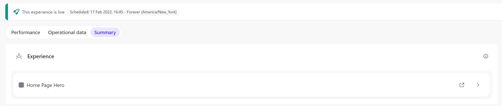
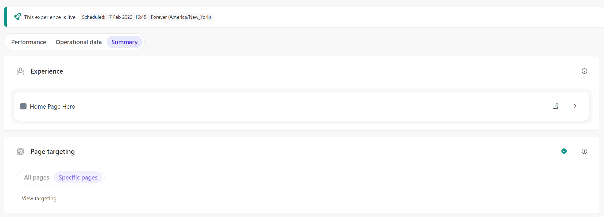
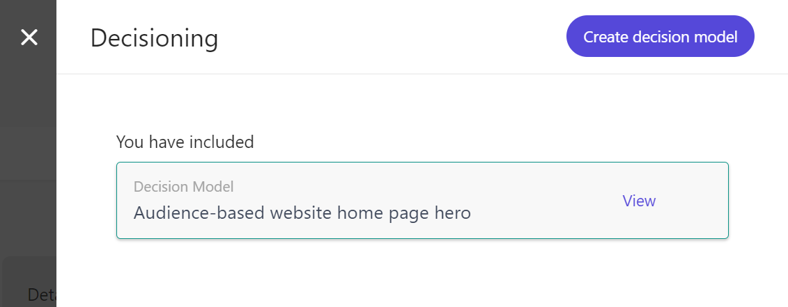
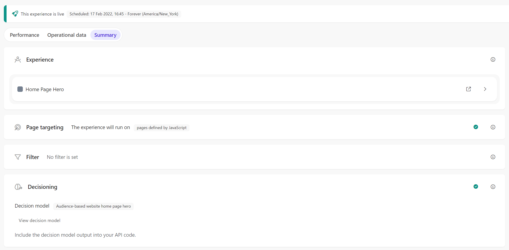
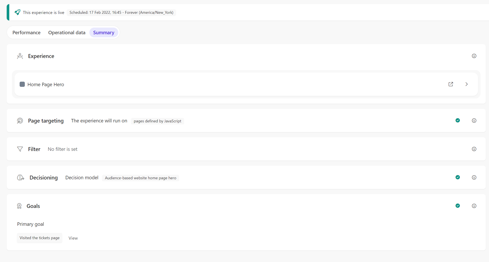

# Web Experience - Website - Audience-based website home page hero V2

[Serialized assets](/demo/experience/personalize/experiences/web/Website%20-%20Audience-based%20website%20home%20page%20hero)

## How to Replicate

1. Navigate to the web experiences page.

   

2. Click the "Create Experience" button.

   

3. Enter the following information:

   | Field | Value                                              |
   | ----- | -------------------------------------------------- |
   | Name  | Website - Audience-based website home page hero V2 |

4. click the "Create" button.

   

5. Home Page Hero

   1. In the create variant sidebar, choose "Create template".

      

   2. In the top-left corner, change the name of the variant.
      1. From: Variant 1
      2. To: Home Page Hero
   3. In the HTML tab, replace the content by the content of [this file](/demo/experience/personalize/experiences/web/Website%20-%20Audience-based%20website%20home%20page%20hero%20V2/Home%20Page%20Hero.html).
   4. In the CSS tab, replace the content by the content of [this file](/demo/experience/personalize/experiences/web/Website%20-%20Audience-based%20website%20home%20page%20hero%20V2/Home%20Page%20Hero.css).
   5. In the JavaScript tab, replace the content by the content of [this file](/demo/experience/personalize/experiences/web/Website%20-%20Audience-based%20website%20home%20page%20hero%20V2/Home%20Page%20Hero.js).
   6. In the API tab, replace the content by the content of [this file](/demo/experience/personalize/experiences/web/Website%20-%20Audience-based%20website%20home%20page%20hero%20V2/Home%20Page%20Hero.txt).
   7. Click the "Save" button.
   8. Click the "Close" button.

      

6. Page Targeting

   1. Under "Page Targeting", click the "Specific Pages" and then the "Add conditions" button.

      

   2. Under "Advanced targeting", click the "Add script" button.

      

   3. In the JavaScript tab, replace the content by the content of [this file](/demo/experience/personalize/experiences/web/Website%20-%20Audience-based%20website%20home%20page%20hero%20V2/Advanced%20targeting%20Script.js).
   4. Click the "Save" button.
   5. Click the back button.

      

   6. Delete the "Contains" page targeting entry.

      

   7. Click the "Save" button.
   8. Close the targeting side panel.

      

7. Decisioning

   1. Under "Decisioning", click the "Add" button.

      

   2. Next to the "Audience-based website home page hero" decision model, click the "Add" button.

      

   3. Close the decisioning side panel.

      

8. Goals

   1. Under "Goals", click the "Add goals" button.

      

   2. Select "Page View Goal".

      

   3. Enter the following information:

      | Field             | Value                    |
      | ----------------- | ------------------------ |
      | Goal name         | Visited the tickets page |
      | Description       | Visited the tickets page |
      | Match condition   | Regex                    |
      | String            | `.+/tickets`             |
      | Target Result (%) | 50                       |

   4. Click the "Save" button.

      

9. At the top of the page, click the "Start" button.

   

10. Click the "Start" button.
