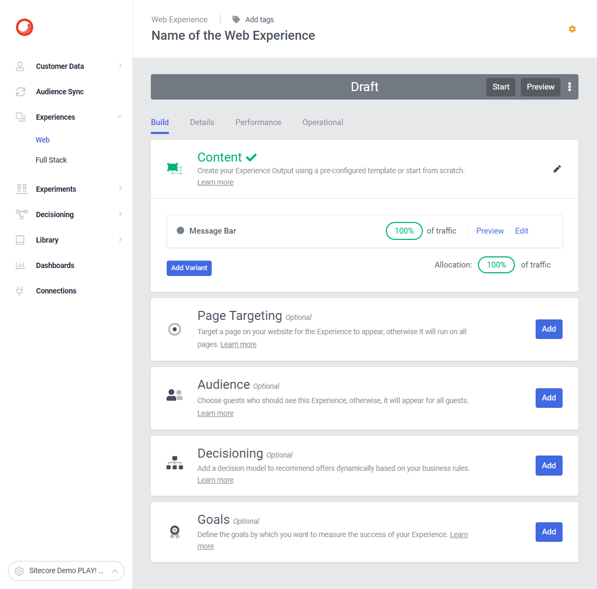

# Web Experience - Website - Message Bar Below Header

[Serialized assets](/demo/experience/personalize/experiences/web/Website%20-%20Message%20Bar%20Below%20Header)

## How to Replicate

1. Navigate to the web experiences page.

   

2. Click the "Create Experience" button.

   

3. Enter the following information:

   | Field | Value                              |
   | ----- | ---------------------------------- |
   | Name  | Website - Message Bar Below Header |

4. click the "Create" button.

   

5. Message Bar

   1. In the create variant sidebar, choose "Create template".

      

   2. In the top-left corner, change the name of the variant.
      1. From: Variant 1
      2. To: Message Bar
   3. In the HTML tab, replace the content by the content of [this file](/demo/experience/personalize/experiences/web/Website%20-%20Message%20Bar%20Below%20Header/Message%20Bar.html).
   4. In the CSS tab, replace the content by the content of [this file](/demo/experience/personalize/experiences/web/Website%20-%20Message%20Bar%20Below%20Header/Message%20Bar.css).
   5. In the JavaScript tab, replace the content by the content of [this file](/demo/experience/personalize/experiences/web/Website%20-%20Message%20Bar%20Below%20Header/Message%20Bar.js).
   6. In the API tab, replace the content by the content of [this file](/demo/experience/personalize/experiences/web/Website%20-%20Message%20Bar%20Below%20Header/Message%20Bar.txt).
   7. Click the "Save" button.
   8. Click the "Close" button.

      

6. Page Targeting

   1. Under "Page Targeting", click the "Specific Pages" and then the "Add conditions" button.

      

   2. Under "Advanced targeting", click the "Add script" button.

      

   3. In the JavaScript tab, replace the content by the content of [this file](/demo/experience/personalize/experiences/web/Website%20-%20Audience-based%20website%20home%20page%20hero%20V2/Advanced%20targeting%20Script.js).
   4. Click the "Save" button.
   5. Click the back button.

      

   6. Delete the "Contains" page targeting entry.

      

   7. Click the "Save" button.
   8. Close the targeting side panel.

      

7. Do not start this experience as it will conflict with the dynamic welcome message experience. Both are displaying a blue message bar.
