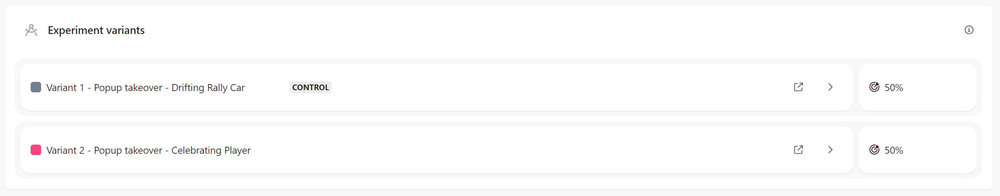
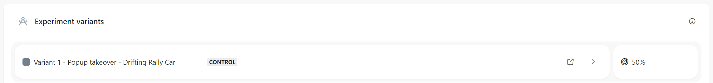
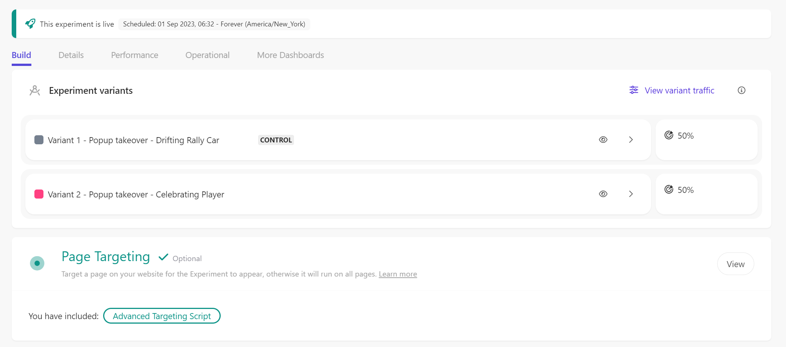
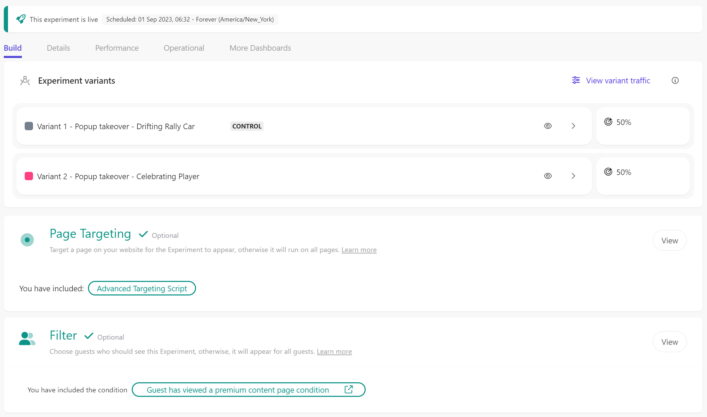
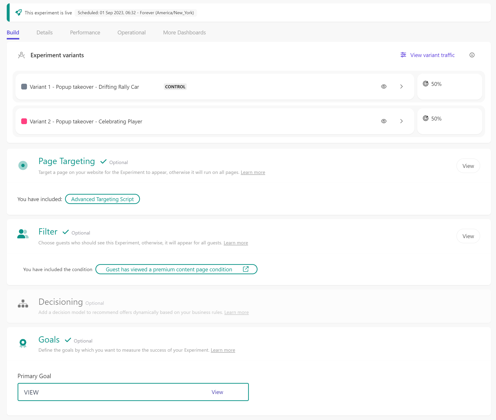

# Web Experiment - Premium Session Page - VIP Ticket Upgrade

[Serialized assets](/demo/experience/personalize/experiments/web/Ticket%20Checkout%20-%20VIP%20Upsell/)

## How to Replicate

1. Navigate to the web experiments page.

   

2. Click the "Create Experiment" button.

   

3. Enter the following information:

   | Field | Value                        |
   | ----- | ---------------------------- |
   | Name  | Ticket Checkout - VIP Upsell |

4. Click the "Create" button.

   

5. Variant 2 - Popup takeover - Celebrating Player

   1. Under "Variants", click the "Create variant" button.

      

   2. Choose "Create template".

      

   3. In the top-left corner, change the name of the variant.
      1. From: Variant 1
      2. To: Variant 2 - Popup takeover - Celebrating Player
   4. In the HTML tab, replace the content by the content of [this file](/demo/experience/personalize/experiments/web/Ticket%20Checkout%20-%20VIP%20Upsell/Variant%202%20-%20Popup%20takeover%20-%20Celebrating%20Player.html).
   5. In the CSS tab, replace the content by the content of [this file](/demo/experience/personalize/experiments/web/Ticket%20Checkout%20-%20VIP%20Upsell/Variant%202%20-%20Popup%20takeover%20-%20Celebrating%20Player.css).
   6. In the JavaScript tab, replace the content by the content of [this file](/demo/experience/personalize/experiments/web/Ticket%20Checkout%20-%20VIP%20Upsell/Variant%202%20-%20Popup%20takeover%20-%20Celebrating%20Player.js).
   7. In the API tab, replace the content by the content of [this file](/demo/experience/personalize/experiments/web/Ticket%20Checkout%20-%20VIP%20Upsell/Variant%202%20-%20Popup%20takeover%20-%20Celebrating%20Player.txt).
   8. Click the "Save" button.
   9. Click the back button.

      

6. Variant 1 - Popup takeover - Drifting Rally Car

   1. Under "Variants", next to the "Original" variant, click the "Edit" link.

      

   2. In the top-left corner, change the name of the variant.
      1. From: Original
      2. To: Variant 1 - Popup takeover - Drifting Rally Car
   3. In the HTML tab, replace the content with the content of [this file](/demo/experience/personalize/experiments/web/Ticket%20Checkout%20-%20VIP%20Upsell/Variant%201%20-%20Popup%20takeover%20-%20Drifting%20Rally%20Car.html).
   4. In the CSS tab, replace the content with the content of [this file](/demo/experience/personalize/experiments/web/Ticket%20Checkout%20-%20VIP%20Upsell/Variant%201%20-%20Popup%20takeover%20-%20Drifting%20Rally%20Car.css).
   5. In the JavaScript tab, replace the content with the content of [this file](/demo/experience/personalize/experiments/web/Ticket%20Checkout%20-%20VIP%20Upsell/Variant%201%20-%20Popup%20takeover%20-%20Drifting%20Rally%20Car.js).
   6. In the API tab, replace the content with the content of [this file](/demo/experience/personalize/experiments/web/Ticket%20Checkout%20-%20VIP%20Upsell/Variant%201%20-%20Popup%20takeover%20-%20Drifting%20Rally%20Car.txt).
   7. Click the "Save" button.
   8. Click the back button.

      

7. Page Targeting

   1. Under "Page Targeting", click on "Specific pages" and then the "Add conditions" button.

      

   2. Next to "Advanced targeting", click the "Add" button.

      

   3. In the JavaScript tab, replace the content with the content of [this file](/demo/experience/personalize/experiments/web/Premium%20Session%20Page%20-%20VIP%20Ticket%20Upgrade/Advanced%20targeting%20Script.js).
   4. Click the "Save" button.
   5. Click the back button.

      

   6. Delete the "Contains" page targeting entry.

      

   7. Click the "Save" button.
   8. Close the targeting side panel.

      

8. Filter

   1. Under "Filter", click the "Add" button.

      

   2. Click on "Add condition".

      

   3. Click on "Create".

      

   4. Click "Edit" and replace the content with the content of [this file](/demo/experience/personalize/experiments/web/Ticket%20Checkout%20-%20VIP%20Upsell/Guest%20has%20viewed%20a%20premium%20content%20page%20condition.js).
   5. Click the "Save" button.
   6. Click the "Close" button.

      

   7. Close the filter side panel.

      

9. Goals

   1. Under "Goals", click the "Add" button.

      

   2. Select "Page View Goal".

      

   3. Enter the following information:

      | Field           | Value                                    |
      | --------------- | ---------------------------------------- |
      | Goal name       | VIEW                                     |
      | Description     | Purchase of a VIP ticket                 |
      | Match condition | Regex                                    |
      | String          | `.+/tickets/payment/confirmed\?ticket=2` |

   4. Click the "Save" button.

      

10. At the top of the page, click the "Start" button.

    

11. Click the "Start" button.
